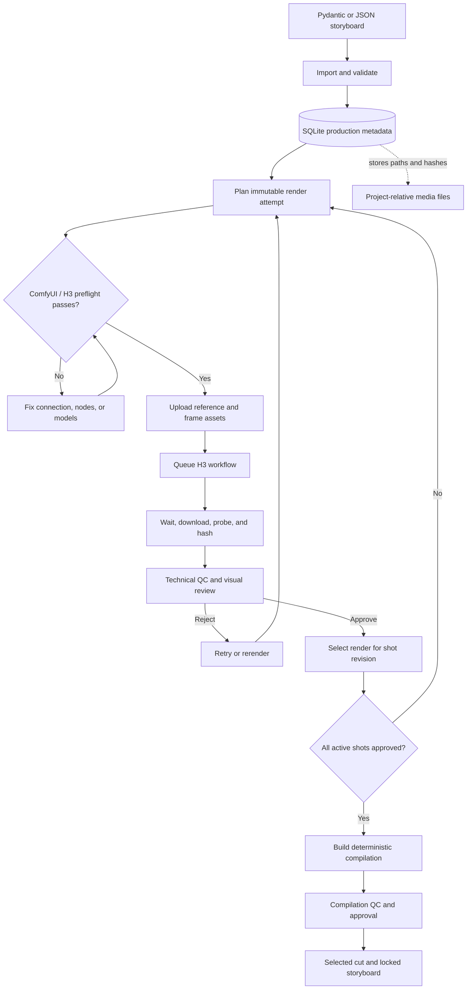
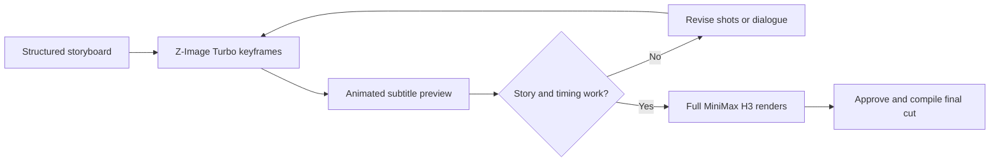

# Storyboard Tools

[](https://github.com/StephanHeijl/storyboard-tools/actions/workflows/ci.yml)
[](https://www.python.org/)
[](https://docs.astral.sh/uv/)
[](LICENSE)

**A durable, agent-facing production layer for turning structured storyboards into reviewed, reproducible video cuts.**

Storyboard Tools keeps shots, revisions, assets, render attempts, approvals, and compilations consistent while ComfyUI and MiniMax H3 do the generation. It is built for humans and agents working on the same production without losing, swapping, or silently overwriting shots.

| Production concern | What Storyboard Tools provides |
|---|---|
| Storyboards | Typed Pydantic authoring, JSON import, numbered shots, immutable revisions, and cheap version snapshots |
| Media | Project-relative assets with hashes, roles, music relationships, and first/last-frame continuity |
| Generation | ComfyUI connectivity, H3 workflow construction, collision-proof attempts, retry, rerender, and recovery |
| Rapid boards | Z-Image Turbo keyframes, timed dialogue subtitles, and animated preview cuts before video rendering |
| Review | Technical QC, contact sheets, explicit approve/reject history, and selected renders |
| Delivery | Deterministic manifests, full `ffmpeg` assembly, compilation approval, and selected-cut discovery |
| Automation | JSON-first commands, stable exit codes, idempotency keys, and no interactive prompts |

Large images, audio, and video remain ordinary project-relative files. One SQLite database per production stores metadata, paths, hashes, relationships, state, and provenance—not binary media or secrets.

## How video creation works



Every render and compilation is a new immutable attempt. Rejections preserve history; approvals select an attempt without deleting earlier work.

## Requirements

| Requirement | Purpose |
|---|---|
| [uv](https://docs.astral.sh/uv/getting-started/installation/) | Installs Python, creates the managed project environment, and resolves the lockfile |
| `ffmpeg` and `ffprobe` | Render probing, contact sheets, continuity-frame extraction, QC, and final assembly; rapid previews require an `ffmpeg` build with the libass `subtitles` filter |
| ComfyUI-compatible server | Accepts workflow, upload, history, queue, and output-download requests |
| MiniMax H3 nodes and models | Provides text/image/reference-conditioned video generation |

Run `uv run storyboardctl doctor` after installation to verify the local database tooling, `ffmpeg`, and `ffprobe`.

## Installation

Storyboard Tools uses [uv](https://docs.astral.sh/uv/) to manage Python, the project environment, and locked dependencies. Full assembly also requires `ffmpeg` and `ffprobe` on `PATH`.

```bash
git clone https://github.com/StephanHeijl/storyboard-tools.git
cd storyboard-tools
uv sync
uv run storyboardctl --help
```

`uv sync` creates and maintains the project environment automatically, installs the locked runtime and development dependencies, and uses the Python version in `.python-version`. Run project commands through `uv run`; manual environment activation is unnecessary.

For a runtime-only environment, omit the development dependency group:

```bash
uv sync --no-dev
uv run storyboardctl --help
```

The examples below use the shorter `storyboardctl …` form for readability. From the repository checkout, prefix it with `uv run`. From another directory, use `uv run --project /path/to/storyboard-tools storyboardctl …`.

## Connect ComfyUI or ComfyStudio

Storyboard Tools talks to the standard ComfyUI HTTP API. If ComfyStudio manages your ComfyUI instance, point Storyboard Tools at the underlying ComfyUI server URL that ComfyStudio exposes. The default is `http://127.0.0.1:8188`.

```bash
export STORYBOARDCTL_COMFY_URL='http://127.0.0.1:8188'
# Only needed when your ComfyUI endpoint or reverse proxy requires bearer auth:
export STORYBOARDCTL_COMFY_TOKEN='your-bearer-token'

uv run storyboardctl comfy ping
uv run storyboardctl comfy queue
uv run storyboardctl comfy preflight
```

- `ping` verifies the server and reports its ComfyUI, Python, and device information.
- `queue` reports running and pending prompts.
- `preflight` checks every H3 node and model required by the bundled adapter before any render is submitted.

For a ComfyUI server on another machine, use its LAN or VPN address, for example `http://192.168.1.50:8188`. The machine running Storyboard Tools must be able to reach that address and port. Configure ComfyUI to listen on an appropriate network interface and use a firewall, VPN, authenticated reverse proxy, or equivalent protection—do not expose an unauthenticated ComfyUI API directly to the public internet.

If a reverse proxy sits between the tools and ComfyUI, it must pass `GET /system_stats`, `GET /queue`, `GET /object_info`, `POST /upload/image`, `POST /prompt`, `GET /history/{prompt_id}`, and `GET /view`. Large uploads and video downloads should not be limited to small request or response bodies.

<details>
<summary>Bundled H3 adapter requirements</summary>

Required H3 nodes:

- `MiniMaxH3ImageToVideo`
- `MiniMaxH3ReferenceToVideo`

The workflow also uses standard ComfyUI loading, sampling, decoding, video, upload, and save nodes. Required model filenames are:

- `minimax_h3_fl2va_pruned_int8_convrot.safetensors`
- `minimax_h3_ref2va_pruned_int8_convrot.safetensors`
- `qwen3vl_32b_minimax_h3_nvfp4_awq.safetensors`
- `minimax_h3_video_vae_fp16.safetensors`
- `minimax_h3_audio_vae_fp32.safetensors`

Model names are configurable in Python through `H3Models`. `storyboardctl comfy preflight` is the authoritative check for the active configuration.

</details>

<details>
<summary>Bundled Z-Image Turbo adapter requirements</summary>

Rapid visual storyboarding uses the official ComfyUI Z-Image Turbo graph with these model filenames:

- `z_image_turbo_int8_convrot.safetensors` (diffusion model)
- `qwen_3_4b_fp8_mixed.safetensors` (text encoder)
- `ae.safetensors` (VAE)

Install them in the corresponding ComfyUI model directories, then run `storyboardctl board preflight`. The tool never
downloads multi-gigabyte models automatically. The preflight reports missing nodes and filenames before a job is queued.

</details>

## Start a production

Create a directory for the production, generate or write a structured spec, then import it:

```bash
mkdir moonlight-production
cd moonlight-production
uv run --project ../storyboard-tools storyboardctl init
uv run --project ../storyboard-tools storyboardctl schema --output project-schema.json
uv run --project ../storyboard-tools storyboardctl import spec ../storyboard-tools/examples/moonlight_delivery.json \
  --idempotency-key initial-import
uv run --project ../storyboard-tools storyboardctl shot list v1
```

The bundled [Python example](examples/moonlight_delivery.py) composes the same JSON with Pydantic models. It is intentionally tiny and fictional.

```python
from pathlib import Path

from storyboardctl.models import ProjectSpec, ShotSpec, StoryboardSpec

project = ProjectSpec(
    slug="sample-film",
    title="Sample Film",
    storyboard=StoryboardSpec(
        name="v1",
        title="First Cut",
        shots=[
            ShotSpec(
                key="arrival",
                title="Arrival",
                description="A courier arrives.",
                prompt="Wide shot of a courier arriving at dawn.",
                duration_seconds=4,
            )
        ],
    ),
)

Path("project.json").write_text(project.model_dump_json(indent=2))
```

Dialogue is structured and timed relative to its shot. H3 prompts compile it to MiniMax's native `(S1)` and
`<d>[English] ...</d>` notation; rapid previews use the same timing for exact burned-in subtitles:

```python
from storyboardctl.models import DialogueCueSpec

ShotSpec(
    key="arrival",
    title="Arrival",
    description="Two friends arrive beneath a glowing entrance sign.",
    prompt="A lively handheld arrival shot with synchronized dialogue.",
    duration_seconds=4,
    dialogue=[
        DialogueCueSpec(
            speaker="Alice",
            speaker_id="S1",
            text="We made it!",
            start_seconds=0.8,
            end_seconds=2.0,
        )
    ],
)
```

Unknown fields, broken asset/shot/music references, duplicate keys, unsafe paths, invalid durations, and conflicting positions fail validation before the database changes.

## The versioning model

A conceptual shot has a stable UUID. Its content is an immutable revision. A storyboard version is an ordered snapshot selecting revisions:

```text
shot UUID ── revision 1 ── used by v1 and v2 ── approved render carries over
          └─ revision 2 ── used only by edited v3 ── requires a new approval
```

Clone a version before restructuring it:

```bash
storyboardctl storyboard clone v1 short-cut --title 'Short Cut'
storyboardctl shot remove short-cut 40 --expect-snapshot 0
```

Shots begin at `10, 20, 30…`. Inserting after `10` chooses `15` when `20` follows. The tool never renumbers implicitly:

```bash
storyboardctl shot add v1 new-shot.json --after 10
storyboardctl storyboard renumber v1 --step 10 --expect-snapshot 4
```

Stable IDs mean explicit renumbering cannot detach assets, links, renders, or approvals. Mutations return the new storyboard snapshot. Pass it back with `--expect-snapshot` when concurrent agents may work on the same version.

## Render and review workflow

Connection details are runtime-only environment variables and are never written to the production database. See [Connect ComfyUI or ComfyStudio](#connect-comfyui-or-comfystudio).

Queue, wait for, and download a shot through ComfyUI:

```bash
storyboardctl render shot v1 20 \
  --settings '{"width":1344,"height":768,"steps":20}'
```

The command creates a render row before the network request, uploads hash-verified linked assets in declared order, writes the exact workflow snapshot, records the ComfyUI prompt ID and state transitions, downloads to a unique filename, probes duration, and hashes the result.

Useful atomic operations:

```bash
storyboardctl render shot v1 20 --seed 123 --plan-only
storyboardctl render status RENDER_ID
storyboardctl render reconcile RENDER_ID
storyboardctl render retry RENDER_ID
storyboardctl render rerender RENDER_ID --seed 456
storyboardctl review approve RENDER_ID --reviewer agent-qa --notes 'Identity stable'
storyboardctl review reject RENDER_ID --notes 'Continuity jump at final frame'
storyboardctl review history RENDER_ID
```

Agents can submit without holding a process open, then resume by ID:

```bash
storyboardctl render shot v1 20 --no-wait
storyboardctl render execute RENDER_ID --no-wait
storyboardctl render wait RENDER_ID
storyboardctl render list --version v1 --position 20
```

If submission fails after planning, the JSON error details include the render ID, attempt number, workflow path, and output path.

Live ComfyUI checks replace raw REST probes:

```bash
uv run storyboardctl comfy ping
uv run storyboardctl comfy queue
uv run storyboardctl comfy preflight
```

`preflight` checks the H3 nodes and configured model filenames before a render is submitted. Schema-level negative prompts are converted into explicit `AVOID:` instructions in H3's saved workflow because H3 has no separate negative-conditioning input.

`retry` preserves the exact seed and settings. `rerender` keeps the settings and selects a new random seed unless one is supplied. Every attempt gets a monotonic attempt number and UUID fragment; files are never overwritten.

Approving a completed render selects it for that exact shot revision and supersedes the earlier selection without deleting review history. Storyboard clones share that approval while they share the revision. Editing prompt, duration, render settings, assets, frames, or other render-relevant data creates a revision with no approval.

## Rapid visual storyboarding

Validate a sequence cheaply before spending time on full H3 video renders:

```bash
storyboardctl board preflight
storyboardctl board frame v1 10                 # render or rerender one keyframe
storyboardctl board frame v1 20 --plan-only    # persist a plan without contacting ComfyUI
storyboardctl board render v1                  # fill missing frames for active revisions
storyboardctl board build v1                   # animated, subtitled MP4 from completed frames
storyboardctl board create v1                  # preflight + render missing + build
storyboardctl board list v1 --position 20
storyboardctl board reconcile PREVIEW_ID       # finish an interrupted prepared preview publish
```

Each image prompt comes from the shot description, with written text explicitly excluded so dialogue does not leak into
the generated image. Each attempt records its seed, settings, workflow snapshot, output path, hash, and ComfyUI prompt ID.
The preview selects the newest completed frame for each active shot revision, applies a restrained alternating slide/zoom,
burns timed dialogue with `ffmpeg`/libass, and records an immutable manifest and output hash. It intentionally has no audio.
Preview publication records a recoverable prepared state before atomically moving files, so an interrupted finalization can
be resumed by ID without rebuilding or accepting unverified artifacts.

This creates a second, faster review loop before the full video path:



## Assets and music

Paths are normalized relative to the production root. Registration records a SHA-256 hash:

```bash
storyboardctl asset add courier image assets/courier.png
storyboardctl asset verify courier
storyboardctl asset link v1 20 courier --role reference --order 0
storyboardctl asset link v1 20 opening-frame --role first_frame --order 0
```

Structured specs can define reusable music cues and associate them with shots as `starts_here`, `continues`, or `associated`. Cue metadata is preserved in the database and compilation manifest. Version 0.1 deliberately does not mix music; that remains a separate audio-finishing concern.

## Compile approved renders

Generate a pinned manifest without encoding:

```bash
storyboardctl compile manifest v1 --width 1920 --height 1080 --fps 24
```

Or assemble the full cut:

```bash
storyboardctl compile build v1 --width 1920 --height 1080 --fps 24
```

Run reproducible technical QC and review the assembled cut:

```bash
storyboardctl render qc RENDER_ID
storyboardctl compile qc COMPILATION_ID
storyboardctl compile approve COMPILATION_ID --reviewer agent-qa --notes 'Cut accepted'
storyboardctl compile reject COMPILATION_ID --notes 'Continuity issue at first cut'
storyboardctl compile history COMPILATION_ID
storyboardctl compile list --version v1
storyboardctl compile selected v1
storyboardctl qc list --render-id RENDER_ID
storyboardctl qc list --compilation-id COMPILATION_ID
storyboardctl storyboard lock v1
```

QC writes JSON reports, contact sheets, cut-boundary sheets, decode results, hashes, black/freeze findings, and audio-level measurements under `review/`, and records successful and failed attempts in SQLite. Discovery commands return the latest report with each render or compilation, while `qc list` returns its full history.

Compilation approval selects the accepted cut but deliberately does not change the storyboard's editability. After the cut is approved, use `storyboard lock` to mark that version final; clone it before making further structural edits.

For a continuity-aware next shot, promote an approved final frame atomically:

```bash
storyboardctl shot bridge v1 10 20 --expect-snapshot 4
```

This extracts shot 10's approved final frame, registers and hashes the image, creates one new revision of shot 20 with a `first_frame` relationship, and switches it to image-to-video.

Production readiness no longer requires direct SQL:

```bash
storyboardctl production status --version v1
storyboardctl storyboard audit v1
```

Readiness checks the selected render's state, immutable revision provenance, on-disk hash, and duration. `production status` also identifies the latest compilation, while `compile selected` returns the explicitly approved cut for downstream delivery.

Compilation stops before `ffmpeg` if any active shot lacks an approved compatible render, an output hash is stale, or a render is shorter than its intended trim duration. Inputs are normalized before concatenation. Outputs are monotonic snapshots such as `assembly/v1/cut_001.mp4`; later builds produce `cut_002.mp4` rather than replacing history.

## Agent contract

JSON is written to stdout by default. Expected failures write one JSON object to stderr and use stable exit statuses:

| Exit | Meaning |
|---:|---|
| 0 | Success |
| 1 | System or unexpected SQLite/file error |
| 2 | Input validation failure |
| 3 | Resource not found |
| 4 | State, snapshot, or uniqueness conflict |
| 5 | ComfyUI, ffmpeg, ffprobe, or other external-service failure |
| 6 | File/path/hash integrity failure |

Use a unique `--idempotency-key` for import or render-planning retries. Commands never ask questions. For people inspecting state, put `--format table` before the command:

```bash
storyboardctl --format table storyboard list
```

## Safety and storage

- Foreign keys, uniqueness constraints, short transactions, WAL mode, and a busy timeout protect the database.
- Version mutations are limited to drafts and support optimistic snapshot checks.
- Normal removal archives metadata. The initial release performs no media-file deletion.
- Symlinks and `..` cannot escape the production root.
- Asset and render hashes are checked at consumption boundaries.
- Network calls never hold a database write transaction.
- Tokens are read from the environment and redacted from configuration representations.
- Databases, local configuration, renders, and assemblies are ignored by the repository template.

See [Schema and invariants](docs/schema.md) for the relational model and [Contributing](CONTRIBUTING.md) for development checks.

## License

MIT. See [LICENSE](LICENSE).
